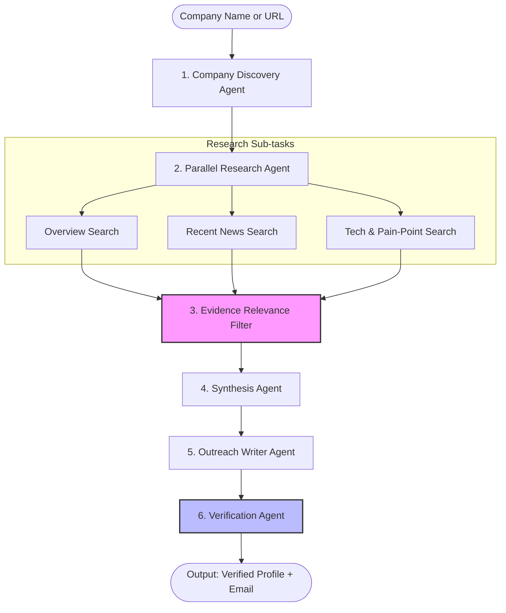

# AI-Powered Sales Lead Research & Personalized Outreach Agent

An advanced, multi-agent AI system designed for B2B sales intelligence. This agent takes a company name or website as input, performs real-time web research, synthesizes a company intelligence profile, drafts a highly personalized cold email, and executes a rigorous **fact-verification pass** to ensure zero hallucinations.

---

## 🚀 The Core Problem & Our Solution

### The Problem
Generative AI makes writing cold outreach emails trivial, but standard AI tools **constantly hallucinate**. Referencing a false funding round, a wrong headquarters location, or an incorrect tech stack in a B2B sales email instantly destroys credibility. 

### The Solution
This agent solves this by enforcing **verification-before-synthesis** and a **strict claim-checking gate**. Every factual claim included in the draft email must be traced back to a specific, filtered piece of retrieved evidence. If a claim cannot be verified, the agent automatically strips it from the draft or flags it for review.

---

## 🛠️ Tech Stack

*   **Orchestration & State Management**: LangGraph (Python)
*   **LLM Provider**: Groq (`llama-3.3-70b-versatile`)
*   **Web Search**: DDGS (DuckDuckGo Search)
*   **Backend Framework**: FastAPI + Pydantic (strict schema validation)
*   **Frontend Interface**: Next.js (TypeScript) + TailwindCSS
*   **Deployment Ready**: Docker (Backend on Render) + Vercel config (Frontend)

---

## 📐 Agentic Architecture (LangGraph Flow)



### 1. Company Discovery Agent
Resolves raw inputs (e.g. `openai` or `openai.com`) to official domains and names to avoid disambiguation errors.

### 2. Parallel Research Agent
Launches concurrent search routines to extract company background, news from the last six months, and technology pain signals.

### 3. Evidence Relevance Filter
Grades and filters incoming search snippets. If a snippet is stale or irrelevant to the prospect company, it is discarded to prevent database-contamination issues.

### 4. Synthesis Agent
Parses filtered snippets into a structured JSON profile using Pydantic schemas. 

### 5. Outreach Writer Agent
Accepts the structured profile and a user's product value proposition, then writes a 3-5 sentence cold outreach email. It is structurally constrained to only mention facts explicitly verified in the company profile.

### 6. Verification Agent
The quality gatekeeper. It cross-checks the draft email's claims against the retrieved source URLs. Unverified claims are stripped before output.

---

## ⚙️ Running Locally

### 1. Prerequisites
Ensure you have the Python Launcher (`py`) and Node.js (`npm`) installed.

### 2. Backend Setup
1. Navigate to the backend directory:
   ```bash
   cd sales_agent/backend
   ```
2. Create and activate a virtual environment:
   ```bash
   py -m venv venv
   .\venv\Scripts\activate
   ```
3. Install dependencies:
   ```bash
   pip install -r requirements.txt
   ```
4. Copy `.env.example` to `.env` and fill in your `GROQ_API_KEY`:
   ```env
   GROQ_API_KEY=your-groq-api-key
   GROQ_MODEL=llama-3.3-70b-versatile
   ```
5. Run the server:
   ```bash
   python -m uvicorn app.main:app --port 8000 --reload
   ```

### 3. Frontend Setup
1. Navigate to the frontend directory:
   ```bash
   cd sales_agent/frontend
   ```
2. Install npm packages:
   ```bash
   npm install
   ```
3. Create `.env.local`:
   ```env
   NEXT_PUBLIC_API_BASE_URL=http://localhost:8000
   ```
4. Run the development server:
   ```bash
   npm run dev
   ```
5. Open your browser and navigate to `http://localhost:3000`.

---

## 🌐 Production Deployment

The project is structured for immediate, zero-config deployment:
*   **Backend**: Exposes a configured [Dockerfile](sales_agent/backend/Dockerfile) ready for deployment on **Render's Free Web Service** tier or **Railway**.
*   **Frontend**: Pre-configured with [vercel.json](sales_agent/frontend/vercel.json) for 1-click hosting on **Vercel's Hobby Tier**.
